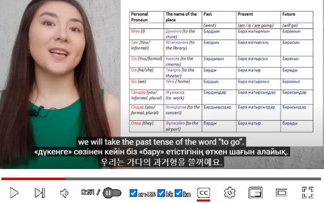
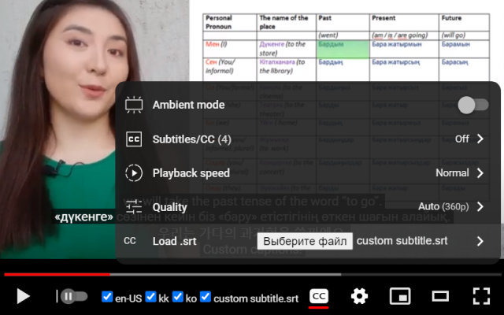

# Youtube Multi

[Chrome Extension](https://chromewebstore.google.com/detail/youtube-multi-captions/mlkecnkjoepkpihbgdbglelggneafihm) to add checkboxes for each provided language caption on Youtube video, allowing to watch several subtitles simultaneously. Additionally, extension also adds an option to add your own .srt subtitle files for videos.





## Videos with multi-lingual subtitles

Here are some of the videos i tested this extension on:

* [Past, present and future tenses of "Go" in Kazakh](https://www.youtube.com/watch?v=xRJKt67K4BA) -- has English, Kazakh, Korean (and an auto-generated Russian track but script disables those unless it's the only subtitle available)

* [도시로 간 처녀(1981) The Maiden Who Went to the City](https://www.youtube.com/watch?v=QHSN2HJiLIQ) -- one of the many old films on Korean Classic Films Archive channel, has English and Korean subtitles.


## Building

Extension is built with [Bun](https://bun.sh). After cloning repository, install dependencies:

```bash
bun install
```

and build unpacked extension:

```bash
bun run cfg/build.ts
```

You can then add directory "public" from that repository to your extensions in Chrome's Developer mode.

## Used libraries

Extension uses [Preact](https://preactjs.com) for UI, and [zustand](https://zustand-demo.pmnd.rs) for state management.
